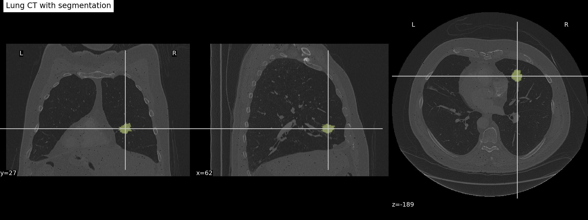
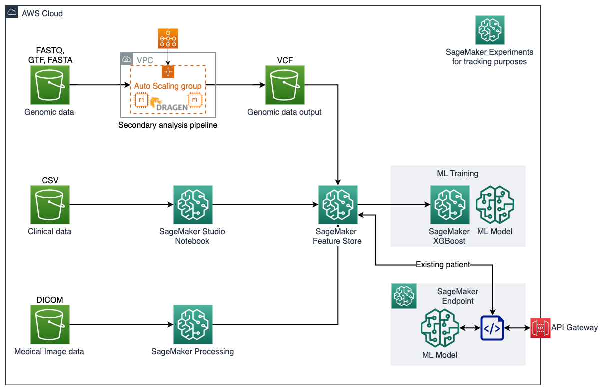
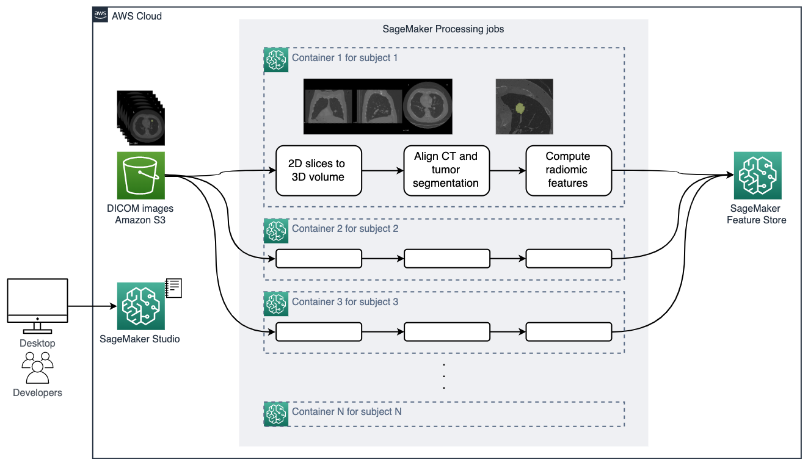

# Lung Cancer Survival Prediction using Multi-Modal data
## Overview
Non–small cell lung cancer (NSCLC) is the most common type of lung cancer and is composed of tumors with significant molecular heterogeneity resulting from differences in intrinsic oncogenic signaling pathways [1]. Enabling precision medicine, anticipating patient preferences, detecting disease, and improving care quality for NSCLC patients are upmost important topic among healthcare and life sciences communities. 

In this solution, we demonstrate how to build a scalable machine learning pipeline for multi-modal heathcare data using the [Non-Small Cell Lung Cancer (NSCLC) Radiogenomics dataset](https://wiki.cancerimagingarchive.net/display/Public/NSCLC+Radiogenomics), which consists of RNA sequencing data, clinical data (reflective of EHR data), and medical images [2]. We predict survival outcome of patients diagnosed with non-small cell lung cancer.

### What Does the Input Data Look Like?
The [Non-Small Cell Lung Cancer (NSCLC) Radiogenomics dataset](https://wiki.cancerimagingarchive.net/display/Public/NSCLC+Radiogenomics) consists a cohort of early stage NSCLC patients referred for surgical treatment. Prior to surgical procedures, Computed Tomography (CT) and Positron Emission Tomography/CT (PET/CT) are performed. Samples of tumor tissues were used to obtain mutation data and gene expresssion data by RNA sequencing technology. Clinical and demographic information were recorded for the patients as well.

Details for each modality is described below.

#### Medical imaging
Medical imaging biomarkers of cancer promise improvements in patient care through advances in precision medicine. Compared to genomic biomarkers, imaging biomarkers provide the advantages of being non-invasive, and characterizing a heterogeneous tumor in its entirety, as opposed to limited tissue available via biopsy [2]. In this dataset, CT and PET/CT imaging sequences were acquired for patients prior to surgical procedures. Segmentation of tumor regions were annotated by two expert thoracic radiologists. Below is an example overlay of a tumor segmentation onto a lung CT scan (case R01-093).



Medical imaging data is commonly stored in the [DICOM](https://www.dicomstandard.org/) file format, a standard that combines metadata and pixel data in a single object. For a volumetric scan, such as a lung CT scan, each cross-section slice is typically stored as an individual DICOM file. However, for ML purposes, analyzing 3-dimensional data provides a more wholistic view of the region of interest (ROI), thus providing better predictive values. In this dataset, the source dataset is stored in DICOM format organized by patient/study/imaging sequence, as shown in the directory structure below.

```
R01-093/  # patient case ID
   ├── 1.3.6.1.4.1.14519.5.2.1.4334.1501.240670240758603778272625719701/  # imaging study ID 1
   │   ├── 06-22-1994/  # date of imaging study 1
   │   │   ├── 1.3.6.1.4.1.14519.5.2.1.4334.1501.142853031813998654275885617348.json  # metadata for an imaging sequence
   │   │   ├── 1.3.6.1.4.1.14519.5.2.1.4334.1501.142853031813998654275885617348/  # corresponding imaging sequence
   │   │   │   ├── 1.3.6.1.4.1.14519.5.2.1.4334.1501.268122123877676186625117813999.dcm  # DICOM file(s) for the imaging sequence
   │   │   │   └── ... if there are more *.dcm files
   │   │   ├── 1.3.6.1.4.1.14519.5.2.1.4334.1501.143700250022821944637075337096.json
   │   └───┴── 1.3.6.1.4.1.14519.5.2.1.4334.1501.143700250022821944637075337096/
   │           └── *.dcm
   ├── 1.3.6.1.4.1.14519.5.2.1.4334.1501.891373270862787721463778581588/  # imaging study ID 2
   │   ├── 08-31-1994/  # date of imaging study 2
   │   │   ├── 1.3.6.1.4.1.14519.5.2.1.4334.1501.127121510050458520043845333993/
   │   │   ├── 1.3.6.1.4.1.14519.5.2.1.4334.1501.127121510050458520043845333993.json
   │   │   ├── 1.3.6.1.4.1.14519.5.2.1.4334.1501.133664984480262659047625676012/
   │   │   ├── 1.3.6.1.4.1.14519.5.2.1.4334.1501.133664984480262659047625676012.json
   │   │   ├── 1.3.6.1.4.1.14519.5.2.1.4334.1501.172375466107449789684787272970/
   │   │   ├── 1.3.6.1.4.1.14519.5.2.1.4334.1501.172375466107449789684787272970.json
   │   │   ├── 1.3.6.1.4.1.14519.5.2.1.4334.1501.204884611948428816419269906683/
   │   │   ├── 1.3.6.1.4.1.14519.5.2.1.4334.1501.204884611948428816419269906683.json
   │   │   ├── 1.3.6.1.4.1.14519.5.2.1.4334.1501.257442018730697717273113074489/
   │   │   ├── 1.3.6.1.4.1.14519.5.2.1.4334.1501.257442018730697717273113074489.json
   │   │   ├── 1.3.6.1.4.1.14519.5.2.1.4334.1501.287138696590093616857690167236/
   │   │   ├── 1.3.6.1.4.1.14519.5.2.1.4334.1501.287138696590093616857690167236.json
   │   │   ├── 1.3.6.1.4.1.14519.5.2.1.4334.1501.327652266327905984847451930257/
   └───┴───┴── 1.3.6.1.4.1.14519.5.2.1.4334.1501.327652266327905984847451930257.json
```

#### Genomic 
Total RNA was extracted from the tumor tissue and analyzed with RNA sequencing technology. 
The dataset file that is available from the source was pre-processed using open-source tools including STAR v.2.3 for alignment and Cufflinks v.2.0.2 for expression calls. Further details can be found in [3]. The original dataset (GSE103584_R01_NSCLC_RNAseq.txt.gz) is also available in https://www.ncbi.nlm.nih.gov/geo/query/acc.cgi?acc=GSE103584.

While the original data contains more than 22,000 genes, we keep 21 genes from 10 highly coexpressed gene clusters (metagenes) that were identified, validated in publicly available gene-expression cohorts, and correlated with prognosis [3]. These are genes corresponding to Metagenes 19, 10, 9, 4, 3, 21 in Table 2 in [3]. The values denote expression level for each gene per patient.

After gene selection from the source data, the dataset looks like

| Case_ID   |    LRIG1 |    HPGD |     GDF15 |    CDH2 |    POSTN |  ......  |
|:----------|---------:|--------:|----------:|--------:|---------:|---------:|
| R01-024   | 26.7037  | 3.12635 | 13.0269   | 0       | 36.4332  |  ......  |
| R01-153   | 15.2133  | 5.0693  |  0.908663 | 0       | 32.8595  |  ......  |
| R01-031   |  5.54082 | 1.23083 | 29.8832   | 1.13549 | 34.8544  |  ......  |
| R01-032   | 12.8391  | 7.21931 | 12.0701   | 0       |  7.77297 |  ......  |
| R01-033   | 33.7975  | 3.19058 |  5.43418  | 0       |  9.84029 |  ......  |

#### Clinical record
The clinical records are stored in CSV format. Each row corresponds to a patient and the columns represent information about the patients, including demographics, tumor stage, and survival status. 

| Case ID   |   Age at Histological Diagnosis | Weight (lbs)   | Smoking status   | Pack Years    |   Quit Smoking Year | Chemotherapy   | Adjuvant Treatment   | EGFR mutation status   | Survival Status   |
|:----------|--------------------------------:|:---------------|:-----------------|:--------------|--------------------:|:---------------|:---------------------|:-----------------------|:------------------|
| R01-005   |                              84 | 145            | Former           | 20            |                1951 | No             | No                   | Wildtype               | Dead              |
| R01-006   |                              62 | Not Collected  | Former           | Not Collected |                 nan | No             | No                   | Wildtype               | Alive             |
| R01-007   |                              68 | Not Collected  | Former           | 15            |                1968 | Yes            | Yes                  | Wildtype               | Dead              |
| R01-008   |                              73 | 102            | Nonsmoker        | nan           |                 nan | No             | No                   | Wildtype               | Alive             |
| R01-009   |                              59 | 133            | Current          | 100           |                 nan | No             | No                   | Wildtype               | Dead              |

### How to Prepare Your Data to Feed into the Model
For genomic data, we keep 21 genes from 10 highly coexpressed gene clusters (metagenes) that were identified, validated in publicly available gene-expression cohorts, and correlated with prognosis [3]. Please see [1_preprocess_genomic_data.ipynb](./src/1_preprocess_genomic_data.ipynb) for detail.

For clinical data, we perform one hot encoding to convert categorical attributes to numerical attributes, remove columns such as dates that do not provide information, and remove rows with missing values. Please see [2_preprocess_clinical_data.ipynb](./src/2_preprocess_clinical_data.ipynb) for detail.

For medical imaging data, we create patient-level 3-dimensional radiomic features that explain the size, shape and visual attributes of the tumors observed in the CT scans. For each patient study, the following steps is performed. Please see [3_preprocess_imaging_data.ipynb](./src/3_preprocess_imaging_data.ipynb) for detail.

- Read the 2D DICOM slice files for both the CT scan and tumor segmentation, combine them to 3D volumes, save the volumes in NIfTI format,
- Align CT volume and tumor segmentation so we can focus the computation inside the tumor,
- Compute radiomic features describing the tumor region using the [pyradiomics](https://www.radiomics.io/pyradiomics.html) library [4]. We extract 120 radiomic features of 8 classes (https://pyradiomics.readthedocs.io/en/latest/features.html) such as statistical representations of the distribution and co-occurrence of the intensity within tumorous region of interest, and shape-based measurements describing the tumor morphologically.

To create a multi-modal view of a patient for model training, we join the feature vectors from three modalities. We then process the data with the following steps:
- Normalize the range of independent features using feature scaling,
- Perform principal component analysis (PCA) on the features to reduce the dimensionality and identify the most discriminative features that contribute 99% **(to be updated)** variance in the data, 
This results in a dimensionality reduction from 215 features down to 65 **(to be updated)** principal components, which constitute features for the supervised learner.

### What Algorithm is Used?
To train the ML model to predict patient survival status, we use the SageMaker built-in XGBoost estimator for binary classification.

### What Are the Outputs?


## Architecture Overview
The solution architecture is illustrated below. We demonostrate the use of SageMaker Feature Store to store and manage multi-modal health data for machine learning training and inference purposes.



As described above in [How to Prepare Your Data to Feed into the Model](#how-to-prepare-your-data-to-feed-into-the-model), we process data of each modality in three separate notebooks, create and ingest features into per-modality feature groups. Come training time, we flexibly choose multi-modal features using an SQL query against the offline store in SageMaker Feature Store and apply machine learning specific preprocessing and dimensionality reduction prior to training an XGBoost model from SageMaker built-in algorithm to predict the survival status of the patients. After model is trained, we host the XGBoost model in a SageMaker real-time endpoint for testing and inference purposes.

It is worth mentioning how the medical imaging pipeline is done at scale. Processing hundreds of large, high-resolution 3D requires the right compute resource. Furthermore, parallelization could drastically improve the total processing time and help you get the results sooner. We use SageMaker Processing, an on-demand, scalable feature for data processing need in SageMaker, to run 1/ DICOM to 3D volume construction, 2/ CT/tumor segmentation alignment, 3/ radiomic feature extract, and 4/ feature store ingestion. We parallelize the processing to 1 job per patient data. See the illustration below.



## Clean Up
After you are done using the solution notebook, make sure to delete all AWS resources that you don’t need to keep running. You can use AWS CloudFormation to automatically delete all standard resources that the solution and the notebook created. Go to the AWS CloudFormation console and delete the parent stack. Deleting the parent stack will automatically delete the nested stacks.

*Caution*: You need to manually delete any other resources that you may have created while running the notebook, such as Amazon S3 buckets to the solution's default bucket, Amazon SageMaker Feature Store, Amazon SageMaker Experiments, Amazon SageMaker endpoints using custom names, and Amazon ECR repositories.

## FAQ
### Q. Why multi-modal ML?
Applying machine learning to help achieve the goal has been accelerated by rapid growth in health information technologies has made patient-level data available from an increasingly diverse set of data modalities. Research has shown that the utility and accuracy of ML models can be improved by incorporating data from multiple data domains [5]. Intuitively, this is understandable, as we are providing our models a more complete view of the individuals and settings we look to describe.

Applying ML to diverse health datasets, known as Multimodal Machine Learning (Multimodal ML), is an active area of research and development. Analyzing linked patient-level data from diverse data modalities, such as genomics and medical imaging, promises to accelerate improvements in patient care. However, performing analysis of a single modality at scale has been challenging in on-premises environments. On-premises processing of multiple modalities of unstructured data has commonly been intractable due to the distinct infrastructure requirements of different modalities. Yet, with AWS, you can readily deploy purpose-built pipelines and scale them to meet your needs, paying only for what you use.

### Q. Who can use this notebook?
The solution can be used by anyone interested in learning multi-modal ML and cloud architecting from a HCLS use case. This solution is most relevant to people working in the HCLS industry. This includes pharmaceutical companies, ISVs, healthcare providers, AMCs, and research institutes. 

### Q. How do I use this notebook?
TBA

### Q. What is the Estimated Cost?
You can expect $13 cost to run this solution in SageMaker Studio, *assuming your notebook kernels are shutdown and your endpoint is deleted after completion*. 

## Useful Resources
This solution is adopted from the blog post series:
- [Building Scalable Machine Learning Pipelines for Multimodal Health Data on AWS](https://aws.amazon.com/blogs/industries/building-scalable-machine-learning-pipelines-for-multimodal-health-data-on-aws/)
- [Training Machine Learning Models on Multimodal Health Data with Amazon SageMaker](https://aws.amazon.com/blogs/industries/training-machine-learning-models-on-multimodal-health-data-with-amazon-sagemaker/)

Below is references mentioned in this page:
1. Travis WD, Brambilla E, Nicholson AG, et al. The 2015 World Health Organization classification of lung tumors: impact of genetic, clinical and radiologic advances since the 2004 classification. J Thorac Oncol 2015;10(9):1243–1260.
2. Bakr, Shaimaa, et al. “A radiogenomic dataset of non-small cell lung cancer.” Scientific data 5.1 (2018): 1-9.
3. Zhou, Mu, et al. "Non–small cell lung cancer radiogenomics map identifies relationships between molecular and imaging phenotypes with prognostic implications." Radiology 286.1 (2018): 307-315.
4. Griethuysen, J. J. M, et. al. Computational Radiomics System to Decode the Radiographic Phenotype. Cancer Research (2017)
5. Huang, Shih-Cheng, et al. “Fusion of medical imaging and electronic health records using deep learning: a systematic review and implementation guidelines.” NPJ digital medicine3.1 (2020): 1-9.

## License
This project is licensed under the Apache-2.0 License.

## Legal Notes
>**<span style="color:RED">Important</span>**: 
>This solution is for demonstrative purposes only. It is not for clinical use. The ML inference should not be used to inform any clinical decision. The associated notebooks, including the trained model and sample data, are not intended for production.