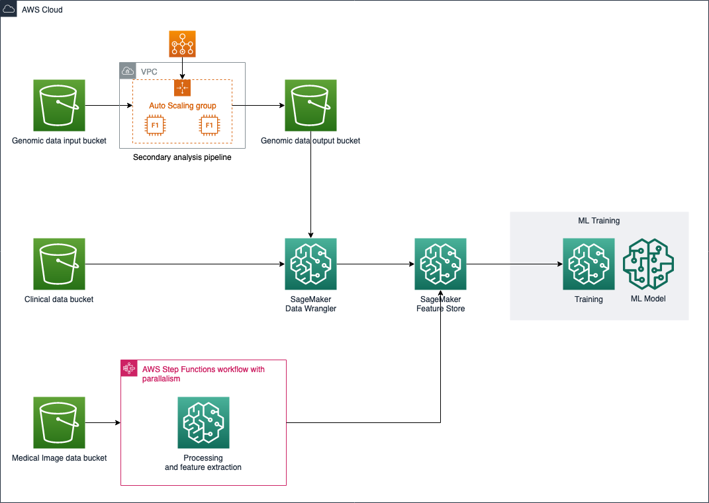

# Analyzing Multimodal Health Data on AWS

## Introduction
This repository contains code samples related to the two-part blog series [Building Scalable Machine Learning Pipelines for Multimodal Health Data on AWS](https://aws.amazon.com/blogs/industries/building-scalable-machine-learning-pipelines-for-multimodal-health-data-on-aws/) and [Training Machine Learning Models on Multimodal Health Data with Amazon SageMaker](https://aws.amazon.com/blogs/industries/training-machine-learning-models-on-multimodal-health-data-with-amazon-sagemaker/)

## Machine Learning Pipelines for Multimodal Health Data

You can use these artifacts to recreate the pipelines and analysis presented in the blog posts, as shown below.  



## Project Structure

Artifacts for processing each data modality are located in corresponding subdirectories of this repo.  

```
./
./genomics/ <-- Artifacts for genomics pipeline
./clinical/ <-- Artifacts for clinical pipeline *
./imaging/  <-- Artifacts for medical imaging pipeline
./model-train-test/ <-- Artifacts for performing model training and testing
```

\* The clinical data can also be preprocessed with Amazon SageMaker Data Wrangler, as discussed in the blog.

## Security

See [CONTRIBUTING](CONTRIBUTING.md#security-issue-notifications) for more information.

## License

This library is licensed under the MIT-0 License. See the LICENSE file.
