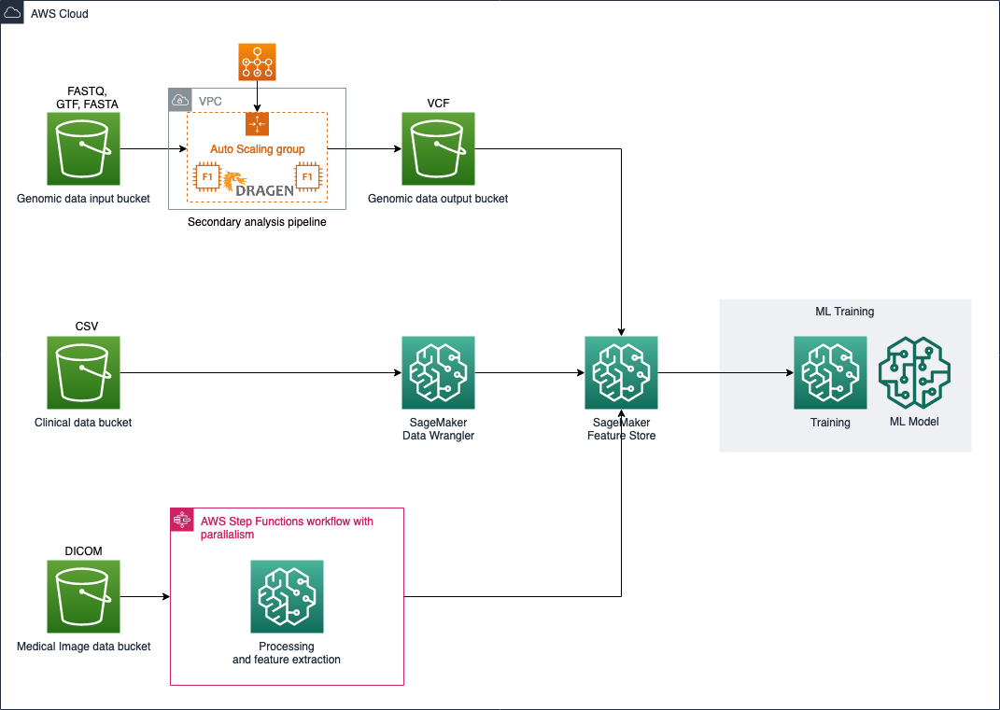

This repository contains code samples related to the two-part blog series [Build Scalable Machine Learning Pipelines for Multimodal Health Data on AWS](https://aws.amazon.com/blogs/) and [Train Machine Learning Models on Multimodal Health Data with Amazon SageMaker](https://aws.amazon.com/blogs/).
## Machine Learning Pipelines for Multimodal Health Data

You can use these artifacts to recreate the pipelines and analysis presented in the blog posts, and shown below.  



## Project Structure

Artifacts for processing each data modality are located in corresponding subdirectories of this repo.  

```
./
./genomics/ <-- Artifacts for genomics pipeline
./imaging/  <-- Artifacts for medical imaging pipeline
./model-train-test/ <-- Artifacts for performing model training and testing
```

There is no directory for the clinical data modality because the blog post demonstrated processing clinical data with Amazon SageMaker Data Wrangler.

## Security

See [CONTRIBUTING](CONTRIBUTING.md#security-issue-notifications) for more information.

## License

This library is licensed under the MIT-0 License. See the LICENSE file.